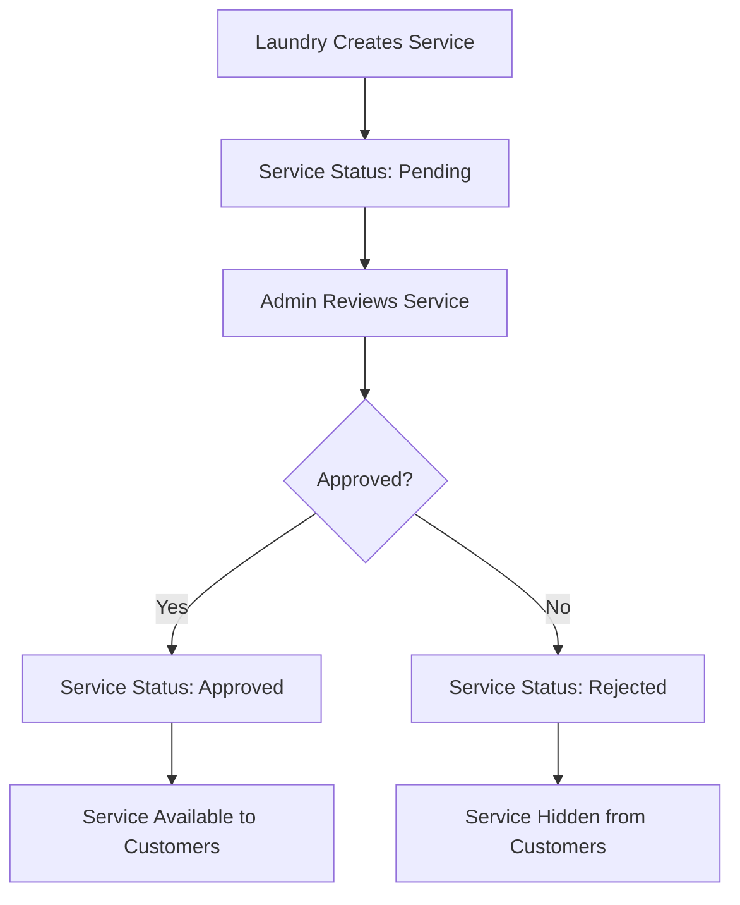
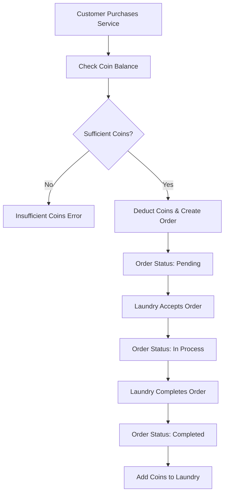
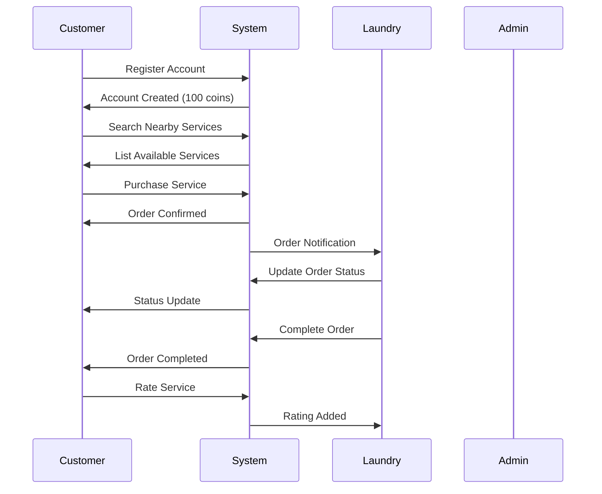
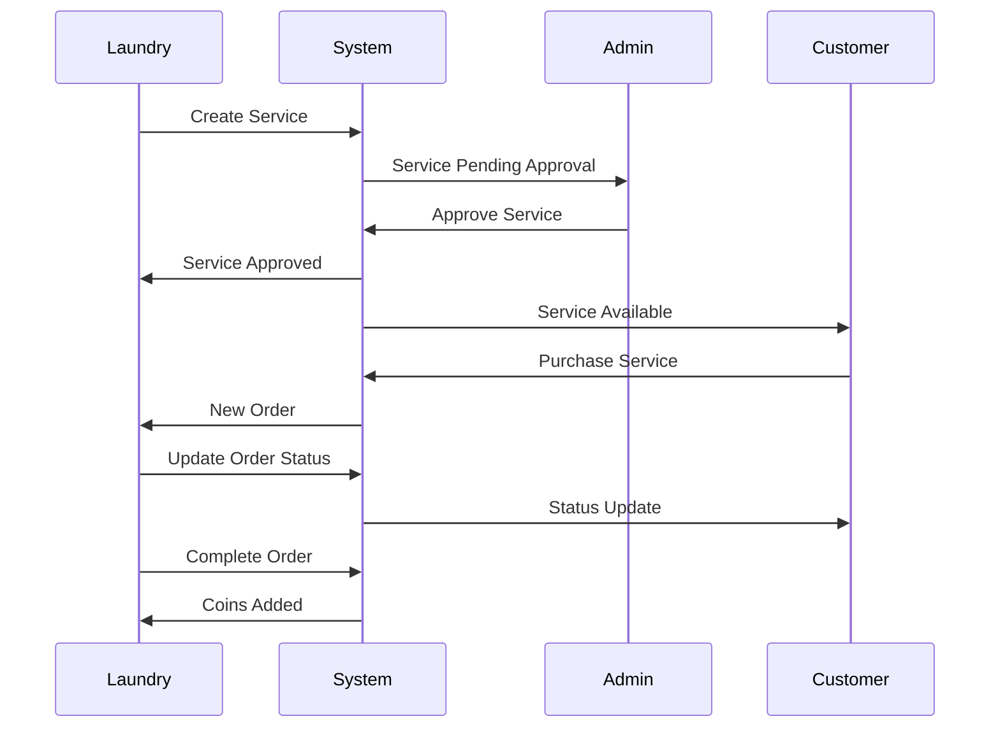

# Laundry Service Application - Complete Guide & Business Logic

## Table of Contents
1. [Application Overview](#application-overview)
2. [System Architecture](#system-architecture)
3. [User Roles & Permissions](#user-roles--permissions)
4. [Core Business Logic](#core-business-logic)
5. [API Endpoints & Usage](#api-endpoints--usage)
6. [Database Models & Relationships](#database-models--relationships)
7. [Workflow Diagrams](#workflow-diagrams)
8. [Business Rules & Constraints](#business-rules--constraints)
9. [Testing & Development](#testing--development)
10. [Deployment & Configuration](#deployment--configuration)

---

## Application Overview

The Laundry Service Application is a comprehensive platform that connects customers with laundry services and agents. It supports multiple user roles, bilingual content (Arabic/English), and a coin-based reward system.

### Key Features
- **Multi-role User Management** (Customer, Laundry, Agent, Worker, Admin)
- **Location-based Service Discovery** with radius search
- **Coin-based Payment System** for services
- **Bilingual Support** (Arabic/English)
- **Real-time Order Management**
- **Rating & Review System**
- **Admin Approval Workflow**

---

## System Architecture

### Technology Stack
- **Backend**: Laravel 10 (PHP)
- **Database**: MySQL/PostgreSQL
- **Authentication**: Laravel Sanctum (Bearer tokens)
- **File Storage**: Laravel Storage (configurable)
- **Email**: Laravel Mail with custom templates
- **API**: RESTful API with JSON responses

### Directory Structure
```
app/
├── Http/Controllers/Api/     # API Controllers
├── Models/                   # Eloquent Models
├── Traits/                   # Reusable Traits
├── Helpers/                  # Utility Functions
├── Mail/                     # Email Templates
└── Providers/                # Service Providers

resources/
├── views/                    # Blade Templates
├── lang/                     # Localization Files
└── css/js/                   # Frontend Assets
```

---

## User Roles & Permissions

### 1. Customer
**Purpose**: End users who purchase laundry services
**Permissions**:
- View nearby laundries and agents
- Purchase services using coins
- Rate and review services
- Manage profile and preferences
- View order history

**Registration Flow**:
1. Provide basic info (name, email, password)
2. Set role as 'customer'
3. Account automatically approved
4. Receive 100 initial coins

### 2. Laundry
**Purpose**: Service providers offering laundry services
**Permissions**:
- Create and manage services
- Handle customer orders
- Manage workers
- Update business status
- View business analytics

**Registration Flow**:
1. Provide business details
2. Set role as 'laundry'
3. Account requires admin approval
4. Can create services (pending approval)

### 3. Agent
**Purpose**: Suppliers providing materials to laundries
**Permissions**:
- Create supply services
- Handle laundry purchases
- Manage inventory
- View transaction history

**Registration Flow**:
1. Provide business details
2. Set role as 'agent'
3. Account requires admin approval
4. Can create supply services

### 4. Worker
**Purpose**: Employees working at laundries
**Permissions**:
- View assigned orders
- Update order status
- Limited profile access

**Registration Flow**:
1. Created by laundry owner
2. Account requires laundry approval
3. Limited access until approved

### 5. Admin
**Purpose**: Platform administrators
**Permissions**:
- Approve/reject services and users
- View platform statistics
- Manage all users and orders
- System configuration

---

## Core Business Logic

### 1. Service Creation & Approval Workflow



**Business Rules**:
- Only laundries can create services
- Services require admin approval before going live
- Rejected services can be updated and resubmitted
- Only approved services appear in customer searches

### 2. Order Processing Workflow



**Business Rules**:
- Customers must have sufficient coins
- Orders can only be cancelled while pending
- Laundry receives coins upon completion
- Order status transitions are controlled

### 3. Coin System Logic

**Coin Flow**:
- **Customer Purchase**: Coins deducted from customer, added to laundry
- **Package Purchase**: Coins added to customer account
- **Agent Supply**: Cash payment, no coins involved
- **Refunds**: Coins returned to customer if order cancelled

**Coin Sources**:
- Initial registration bonus (100 coins)
- Package purchases
- Gift packages from other users
- Refunds from cancelled orders

**Coin Usage**:
- Service purchases
- Cannot be transferred between users
- No negative balance allowed

### 4. Location-Based Service Discovery

**Search Algorithm**:
1. Customer's city is determined
2. Search radius applied (default: 50km)
3. Laundries filtered by:
   - Online status
   - Distance from customer
   - Service availability
4. Results sorted by proximity

**Distance Calculation**:
- Uses city coordinates
- Haversine formula for accuracy
- Configurable search radius
- Maximum distance filtering

---

## API Endpoints & Usage

### Authentication Flow
1. **Register**: `POST /api/auth/register`
2. **Login**: `POST /api/auth/login`
3. **Use Token**: Include `Authorization: Bearer {token}` header
4. **Logout**: `POST /api/auth/logout`

### Service Management
- **Create**: `POST /api/services` (Laundry only)
- **Update**: `PUT /api/services/{id}` (Pending services only)
- **Delete**: `DELETE /api/services/{id}` (Pending services only)
- **List**: `GET /api/services` (Filtered by provider)

### Order Management
- **Purchase**: `POST /api/orders/purchase-service`
- **Status Update**: `PUT /api/orders/{id}/status` (Provider only)
- **Cancel**: `PUT /api/orders/{id}/cancel` (Customer only)
- **History**: `GET /api/orders/history`

### Admin Operations
- **Approve Service**: `PUT /api/admin/services/{id}/approve`
- **Reject Service**: `PUT /api/admin/services/{id}/reject`
- **Bulk Operations**: `POST /api/admin/services/bulk-approve`
- **User Management**: `PUT /api/admin/users/{id}/status`

---

## Database Models & Relationships

### Core Models

#### User Model
```php
- id, name, email, password, role, status, coins
- Relationships: customer(), laundry(), agent(), worker(), admin()
- Status values: pending, approved, rejected
- Role values: customer, laundry, agent, worker, admin
```

#### Service Model
```php
- id, provider_id, name, description, type, price, coin_cost
- Status values: pending, approved, rejected
- Type values: washing, ironing, cleaning, agent_supply, other
- Pricing: Either price OR coin_cost must be set
```

#### Order Model
```php
- id, user_id, recipient_id, provider_id, target_id, target_type
- Status values: pending, in_process, completed, canceled
- Coins field: Negative for spending, positive for earning
```

#### Rating Model
```php
- id, customer_id, laundry_id, rating, comment, service_type
- Rating range: 1-5 stars
- Service types: washing, ironing, cleaning, agent_supply, other
- Update/delete allowed within 24 hours only
```

### Key Relationships
- **User → Service**: One-to-many (provider)
- **User → Order**: One-to-many (customer/recipient)
- **Service → Order**: One-to-many (target)
- **Laundry → Worker**: One-to-many
- **City → Laundry/Agent**: One-to-many

---

## Workflow Diagrams

### Customer Journey


### Laundry Service Management


---

## Business Rules & Constraints

### Service Rules
1. **Pricing**: Must have either price OR coin_cost
2. **Approval**: All services require admin approval
3. **Updates**: Only pending services can be modified
4. **Deletion**: Only pending services can be deleted
5. **Quantity**: Must be positive integer

### Order Rules
1. **Payment**: Sufficient coins required for purchase
2. **Cancellation**: Only pending orders can be cancelled
3. **Status Updates**: Only providers can update status
4. **Refunds**: Automatic coin refund on cancellation
5. **Completion**: Required for coin transfer to provider

### User Rules
1. **Registration**: Email must be unique
2. **Approval**: Laundry/Agent accounts require admin approval
3. **Workers**: Must be approved by laundry owner
4. **Status Changes**: Only admins can change user status
5. **Role Assignment**: Fixed at registration

### Rating Rules
1. **Timing**: Can only rate completed orders
2. **Updates**: Within 24 hours of creation
3. **Deletion**: Within 24 hours of creation
4. **Uniqueness**: One rating per order per customer
5. **Validation**: Rating must be 1-5 stars

---

## Testing & Development

### Testing Strategy
1. **Unit Tests**: Model methods and business logic
2. **Feature Tests**: API endpoints and workflows
3. **Integration Tests**: Database operations and relationships
4. **API Tests**: Postman collection provided

### Development Workflow
1. **Local Development**: Laravel Sail or local environment
2. **Database**: Run migrations and seeders
3. **Testing**: Execute test suite
4. **API Testing**: Use Postman collection
5. **Deployment**: Follow deployment guide

### Common Development Tasks
- **Adding New Service Types**: Update validation and enums
- **Modifying Business Logic**: Update relevant models and controllers
- **Adding New User Roles**: Update registration and permission logic
- **Extending API**: Follow existing controller patterns

---

## Deployment & Configuration

### Environment Variables
```env
APP_ENV=production
APP_DEBUG=false
APP_URL=https://yourdomain.com

DB_CONNECTION=mysql
DB_HOST=your-db-host
DB_DATABASE=laundry_service
DB_USERNAME=your-username
DB_PASSWORD=your-password

MAIL_MAILER=smtp
MAIL_HOST=your-smtp-host
MAIL_USERNAME=your-email
MAIL_PASSWORD=your-password

FILESYSTEM_DISK=public
```

### Deployment Steps
1. **Server Setup**: Configure web server (Nginx/Apache)
2. **Database**: Create database and run migrations
3. **Environment**: Set production environment variables
4. **Dependencies**: Install Composer dependencies
5. **Permissions**: Set proper file permissions
6. **SSL**: Configure HTTPS certificates
7. **Monitoring**: Set up logging and monitoring

### Performance Considerations
- **Database Indexing**: Add indexes on frequently queried fields
- **Caching**: Implement Redis for session and query caching
- **CDN**: Use CDN for static assets and images
- **Load Balancing**: For high-traffic scenarios
- **Database Optimization**: Regular maintenance and optimization

---

## Security Considerations

### Authentication & Authorization
- **Token-based**: Laravel Sanctum for API authentication
- **Role-based Access**: Different permissions per user role
- **Route Protection**: Middleware for protected endpoints
- **Session Management**: Secure token handling

### Data Protection
- **Input Validation**: Comprehensive request validation
- **SQL Injection**: Eloquent ORM protection
- **XSS Protection**: Output escaping and validation
- **File Upload**: Secure file handling and validation

### API Security
- **Rate Limiting**: Prevent abuse and DDoS
- **CORS**: Configured for web application access
- **HTTPS**: Enforced for all communications
- **Token Expiration**: Configurable token lifetimes

---

## Monitoring & Maintenance

### Logging
- **Application Logs**: Laravel logging system
- **Error Tracking**: Exception and error logging
- **API Logs**: Request/response logging
- **Performance Logs**: Query and response time tracking

### Health Checks
- **Database Connectivity**: Regular connection tests
- **API Endpoints**: Automated endpoint testing
- **File Storage**: Storage system availability
- **Email Service**: Mail delivery testing

### Backup Strategy
- **Database Backups**: Regular automated backups
- **File Backups**: User uploads and system files
- **Configuration Backups**: Environment and config files
- **Recovery Procedures**: Documented recovery processes

---

## Future Enhancements

### Planned Features
1. **Real-time Notifications**: WebSocket integration
2. **Mobile Applications**: React Native or Flutter apps
3. **Payment Gateway**: Integration with payment providers
4. **Analytics Dashboard**: Advanced business intelligence
5. **Multi-language Support**: Additional languages beyond Arabic/English

### Scalability Improvements
1. **Microservices**: Break down into smaller services
2. **Queue System**: Implement job queues for heavy operations
3. **API Versioning**: Support multiple API versions
4. **GraphQL**: Alternative to REST API
5. **Event Sourcing**: For complex business workflows

---

## Support & Documentation

### Getting Help
- **API Documentation**: Postman collection provided
- **Code Comments**: Comprehensive inline documentation
- **Test Cases**: Examples of expected behavior
- **Error Messages**: Descriptive error responses

### Contributing
1. **Code Standards**: Follow PSR-12 coding standards
2. **Testing**: Write tests for new features
3. **Documentation**: Update relevant documentation
4. **Code Review**: Submit pull requests for review

---

This guide provides a comprehensive overview of the Laundry Service Application. For specific implementation details, refer to the source code and API documentation. The system is designed to be scalable, maintainable, and follows Laravel best practices.

